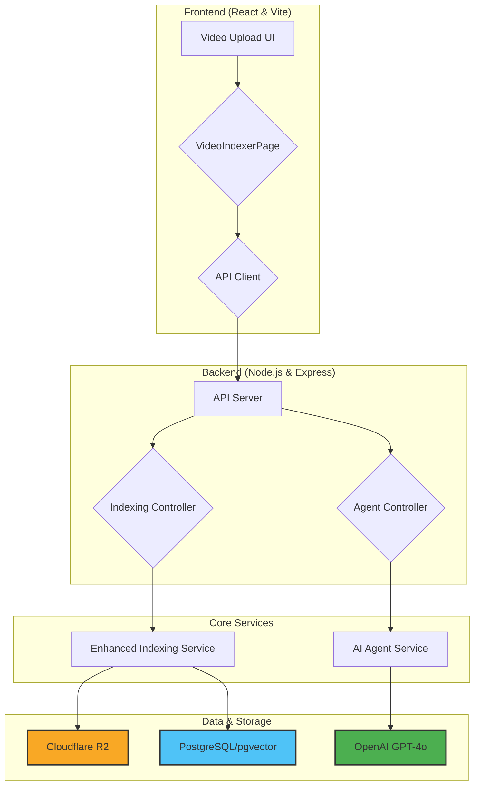

<p align="center">
  <a href="https://github.com/designcombo/react-video-editor">
    
  </a>
</p>
<h1 align="center">React Video Editor</h1>

<div align="center">
  
Video Editor application using React and TypeScript.

<p align="center">
    <a href="https://combo.sh/">Combo</a>
    ·  
    <a href="https://discord.gg/jrZs3wZyM5">Discord</a>
    ·  
    <a href="https://github.com/designcombo/react-video-editor">X</a>
</p>
</div>

[](https://github.com/designcombo/react-video-editor)

## 🚀 Aginno: The AI Video Indexer Engine

This project is more than just a video editor; it's powered by Aginno, an advanced backend engine designed to intelligently index, understand, and transform video content. Aginno uses a multi-stage pipeline to analyze videos and an AI-powered agent to create content, such as highlight reels, based on natural language prompts.

### System Architecture

The system is composed of two main parts: a **React-based frontend** for user interaction and a **Node.js/TypeScript backend** that orchestrates the complex indexing and editing tasks.



### 1. The Indexing Pipeline

When a user uploads a video, Aginno initiates a sophisticated, asynchronous pipeline to deconstruct and analyze its content.

1.  **Video Upload**: The React frontend sends the video file to the API server.
2.  **Metadata & Job Creation**:
    *   The server immediately creates a record for the video in the **PostgreSQL** database.
    *   A unique `jobId` is generated to track the indexing process, and this ID is sent back to the client.
3.  **Cloudflare R2 Storage**: The video is uploaded to a **Cloudflare R2** bucket for durable, accessible storage.
4.  **Frame Extraction**: The system uses `ffmpeg` to extract frames from the video at a configurable rate (e.g., one frame per second).
5.  **Audio Transcription**:
    *   The audio track is stripped from the video.
    *   It's sent to **OpenAI's Whisper API** to generate a time-stamped transcript.
    *   The transcript segments are stored in the database, linked to the video.
6.  **Vision AI Analysis**: Each extracted frame is sent to the **Google Vision API** for deep analysis, which identifies:
    *   Objects and labels (e.g., "person," "car," "tree").
    *   Faces, emotions, and gestures.
    *   Contextual descriptions of the scene.
7.  **Database Storage**: All of this rich metadata—frame descriptions, objects, transcriptions—is stored in the PostgreSQL database and linked to the original video. The `pgvector` extension is used to store vector embeddings for future semantic search capabilities.

The frontend uses a **Server-Sent Events (SSE)** connection to receive real-time progress updates throughout this process, providing a smooth user experience without needing to poll the server.

### 2. The AI Agent Workflow

Once a video is indexed, the user can request edits using natural language (e.g., "Create a short, inspiring highlight reel"). This triggers the AI Agent workflow.

1.  **Prompt & Video ID**: The user's prompt and the `videoId` are sent to the agent controller.
2.  **GPT-4o Orchestration**: The backend forwards the request to **OpenAI's GPT-4o model**. The model is given a system prompt that outlines its role as a video editing assistant and provides it with a set of available "tools" (functions it can call).
3.  **Tool-Based Execution**: GPT-4o decides which tools to use to fulfill the user's request. A typical workflow might be:
    *   `extract_highlight_segment`: The agent first calls this tool to identify and extract the most relevant clips from the video. This can be based on strategies like "peak energy" (detecting action and motion) or "speech highlights" (finding key phrases in the transcript).
    *   `apply_smart_cuts`: (Future Implementation) This tool would refine the timing of the extracted clips for better pacing.
    *   `stitch_segments`: (Future Implementation) Combines the clips with transitions (e.g., fades).
    *   `render_final_reel`: Once the segments are selected and arranged, this tool uses `ffmpeg` to render the final video.
4.  **Download & Process**: To perform these actions, the agent's tools download the original video from the **public R2 bucket**. This is the step that can be sensitive to network or SSL/TLS issues.
5.  **Final Output**: The newly rendered reel is uploaded back to R2, and the public URL is returned to the user.

This powerful, tool-based architecture allows Aginno to handle complex, multi-step editing tasks based on simple, high-level instructions.

## ✨ Features

- 🎬 Timeline Editing: Arrange and trim media on a visual timeline.
- 🌟 Effects and Transitions: Apply visual effects, filters, and transitions.
- 🔀 Multi-track Support: Edit multiple video and audio tracks simultaneously.
- 📤 Export Options: Save videos in various resolutions and formats.
- 👀 Real-time Preview: See immediate previews of edits.

## ⌨️ Development

Clone locally:

```bash
git clone git@github.com:designcombo/react-video-editor.git
cd react-video-editor
pnpm install
pnpm dev
```

Open your browser and visit http://localhost:5173 , see more at [Development](https://github.com/designcombo/react-video-editor/react-video-editor).

## 📝 License

Copyright © 2025 [DesignCombo](https://combo.sh/).